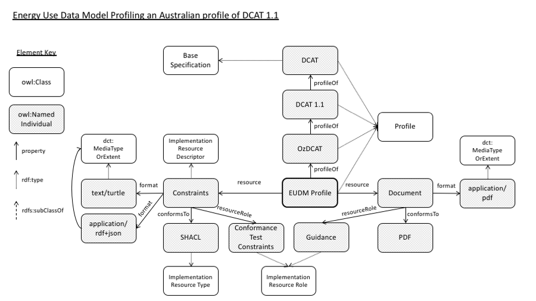

# EUDM Profile
Profile of metadata standards for EUDM datasets

This ontology contains a range of resources describing a profile of well-known metadata standards to be used to characterise datasets within the [EUDM project](https://eudm.csiro.au).

## Profile Description
This profile is described using the emerging *Profile Description Ontology* (PROF), currently under development by the [W3C](https://www.w3.org/)'s [Data Exchange Working Group](https://www.w3.org/2017/dxwg/wiki/Main_Page) of which the authors are members.

PROF is managed here:

* <https://github.com/w3c/dxwg/tree/gh-pages/profiledesc>

...and described, for human consumption, temporarily, here:

* <https://promsns.org/def/prof>

Within the documentation of PROF is contained this profile's description as an example:

* <https://github.com/w3c/dxwg/tree/gh-pages/profiledesc/examples>

The image of describing this profile is also reproduced below.

Figure 1: This EUDM profile described using the Profile Description Ontology.

## Profile Constraints
The constraints for this profile are expressed using [SHACL](http://example.com).

## License
This repository is licensed under the [GPL v3 License](https://www.gnu.org/licenses/gpl-3.0.en.html). See the [LICENSE deed](LICENSE) in this repository for details.

## Contacts
Authors:  
**Simon Cox**  
*Research Scientist*  
CSIRO Land & Water    
<simon.cox@csiro.au>  
<http://orcid.org/0000-0002-3884-3420>

**Nicholas Car**  
*Senior Experimental Scientist*  
CSIRO Land & Water    
<nicholas.car@csiro.au>  
<http://orcid.org/0000-0002-8742-7730>
